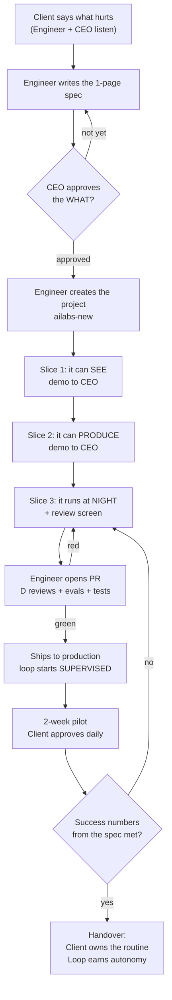

# BUILD_GUIDE.md — Your first build, step by step

> **This is a training assignment, not a case study.** Nothing here has been built for you.
> You are going to build it, following these stages in order, and you'll learn the framework
> by doing it rather than by reading about it.
>
> **Your assignment:** Crushyard Clips. A pickleball club has cameras on its courts and no
> time to edit. You will deliver a product that turns each day's footage into 5\u20137 vertical
> clips for TikTok, Instagram and Facebook \u2014 good enough that 80%+ get approved without
> edits. Your mentor is available; the answers are not written down anywhere else.
>
> **Tomorrow this assignment may be a different one.** The client changes, the nouns change,
> the stages don't. See "Swapping the assignment" at the end.
>
> **New? Read `DAY_ONE.md` first** — it gets you from nothing to a real clip in 90 minutes.
> **Keep `QUICKSTART.md` open in a second window** \u2014 it has every command, ready to paste.
> This file explains *why* each stage exists; QUICKSTART is *what you type*.
>
> This is the **workflow**, in order, in time. Each stage says: **who** does it, **what you
> produce**, **who receives it**, and **when you're done**. After each stage there's a
> *"What just happened, in plain English"*.
>
> Worked example: **Crushyard Clips** — court cameras → 5–7 vertical clips a day →
> TikTok, Instagram, Facebook. Swap the nouns; the workflow never changes.
>
> Three roles appear throughout: **Engineer** (builds), **CEO** (approves the what),
> **Client** (accepts the outcome).
>
> **Effort vs. calendar.** The engineering effort here is roughly **6–8 working days**. The
> calendar is ~3 weeks because two of those weeks are the *supervised pilot* — the product is
> already live and the client is using it; you're measuring, not building. Anything waiting on
> someone else (social platform API approvals) starts on day one, in parallel.

---

## The whole delivery on one page



**Read it as three feedback loops:** the CEO loop (is this the right thing?), the machine
loop (is it built correctly?), and the client loop (does it actually work for them?).
Nothing moves forward until the loop it's in closes.

---

# STAGE 0 (optional, recommended) — The 48-hour spike

**Who:** Engineer alone · **You produce:** ugly clips from the client's real footage
**Done when:** a real clip from a real court video plays on your screen.

No quality bar, no publishing, no fine-tuned brakes. One goal: prove the material works and
put something moving in front of the client in week one. It kills the biggest technical risk
early and lets you say: *"in 48 hours I'll show you clips from your courts; in three weeks
you'll publish them without watching them."*

**What just happened, in plain English:** you found out whether this is even possible before
anyone promised anything. Ugly and real beats polished and hypothetical.

---

# WEEK 1 — Agree on what "done" means

## Stage 1 · Listen to the client (½ day)
**Who:** Engineer + CEO with the client · **You produce:** notes, nothing else
**Done when:** you can repeat their problem back in one sentence and they say "exactly".

Ask three questions and shut up: *What takes you too long today? What would you check to
know it worked? What must never happen?* For Crushyard the answers were: "nobody has time
to edit hours of footage", "we'd be posting 5–7 good clips a day", "never post a kid's face
in close-up".

**What just happened, in plain English:** you found out what they're buying. They're not
buying AI — they're buying 7 clips a day without hiring an editor.

## Stage 2 · Write the spec, get it approved (½–1 day)
**Who:** Engineer writes, CEO approves · **You produce:** a Spec issue in GitHub Projects
**Hand off to:** CEO · **Done when:** the "Approved by CEO" box is ticked.

Four things only: what goes in, what comes out, how success is measured (numbers!), what's
out of scope. Research the unknowns first: Claude for open search, NotebookLM to digest the
sources. **Do not write code yet.** If the CEO sends it back, that's the process working.

**What just happened:** you and the business agreed on the finish line before running.
This is the single step that prevents most rework.

---

---

# HOW YOU ACTUALLY WORK — read this before Week 2

## First, clear up three things

**1. You never "install" the agents.** All five (A, B, C, D, E) arrive with the template,
already wired. What you do is *turn on* the skill a product needs (`config.yaml`) and
*implement its stub* (`packages/skills/...`). There is no installation step, ever.

**2. C and D you never touch.** The dashboard (C) turns itself on with your first run. The
inspector (D) runs by itself on every PR. You only *read their output*.

**3. "Vibe coding" is a step in a cycle, not the whole job.** You describe the outcome, the
agent writes the code, **you read it**, you run it on real data, then you decide. Skipping
the reading is not fast — it's how you ship something you can't fix later.

## The build cycle — 5 moves, repeated per slice

Every build stage in Week 2 is this same cycle. It takes 1–3 hours per round, and a slice
usually takes 2–5 rounds.

| # | Move | Who / how long | What it looks like |
|---|---|---|---|
| 1 | **Prompt** (vibe coding) | You · 10 min | Open `claude` in the repo. Describe the *outcome* in plain words and point at the spec: *"Implement the video-moments skill per Spec #1: given a video URL, return timestamped moments with a score and a reason. Follow CLAUDE.md."* |
| 2 | **Let it work** | Agent · 20–40 min | It writes across several files. You don't watch every line — but stay reachable, it will ask questions. Answer with decisions, not code. |
| 3 | **Read it** (your review) | You · 15 min | Not line by line. Check four things: does it go through the right door (`knowledge`/`core`/`loops`)? did it inline a prompt instead of using `/prompts`? are the caps read from `config.yaml`? does it invent a shortcut the spec didn't ask for? |
| 4 | **Run it on real data** | You · 10 min | Real footage from the client, not a sample. Did a real clip come out? Is it watchable? This is the only proof that counts. |
| 5 | **Decide** | You · 5 min | Good → open the PR (`Spec: #N`). Not good → back to move 1 and *tell the agent exactly what failed*. Never silently fix it yourself: if you do, the next round undoes your fix. |

**When to stop cycling:** when the slice's "Done when" line at the top of the stage is true.
Not when the code looks nice.

## Who reviews what, and when

| Review | Who | When | What they're checking |
|---|---|---|---|
| Move 3, above | You | Every cycle | Did the agent respect our architecture? |
| Automatic review (D) | The machine | Every PR | Standards, spec reference, no secrets, caps in config |
| Quality gate (evals + E2E) | The machine | Every PR | Did the product get worse? Red = no merge |
| Slice demo | CEO | End of each slice | Is this still the right thing to build? |
| Daily approval | Client | During the pilot | Is the output actually usable? |

You are never the last line of defense — but you are the first.

# WEEK 2 — Build it in slices you can show

> The rule for the whole week: **every slice ends in a demo**, not in a status update.
> If you can't demo it, it isn't done. Work in small PRs, each one referencing `Spec: #N`.

## Stage 3 · Create the project (30 min)
**Who:** Engineer · **You produce:** a repo on GitHub with CI green on an empty project
```bash
ailabs-new crushyard-clips && cd ~/ailabs/projects/crushyard-clips
gh repo create <org>/crushyard-clips --private --source=. --push
cp .env.example .env.local     # fill only the keys this product needs
```
**Done when:** CI runs and passes on your first empty PR.

**What just happened:** the project was born with all five components, the quality gate and
the dashboard already wired. You skipped a week of plumbing — and you verified the safety
net works *before* trusting it.

## Stage 4 · Slice 1 — make it SEE (1–2 days)
**Who:** Engineer (Claude Code as pair) · **You produce:** a working `knowledge.query()`
**Demo to:** CEO · **Done when:** you can ask "what happened today?" and get real moments
back, each with its timestamp.

**Your moves:** turn on `skills.vision` in `config.yaml` → run the build cycle 2–4 times
on the `video-moments` skill → wire it into `knowledge.ingest()`.

```bash
claude    # Round 1 prompt:
# "Implement packages/skills/video-moments per Spec #1: given a video URL return
#  timestamped moments with score + reason. Wire it into knowledge.ingest(). Follow CLAUDE.md."
```
Nothing else in the system is allowed to touch raw video — this is the only door in.

**What just happened:** the product can now watch the footage and remember what happened,
with receipts. Every later answer can be traced back to a real moment in a real video.

## Stage 5 · Slice 2 — make it PRODUCE and REFUSE (2–3 days)
**Who:** Engineer · **You produce:** finished clips + captions through `core.run()`
**Demo to:** CEO and (informally) the client · **Done when:** one command turns a moment
into a publishable vertical clip — **and** a clip that breaks a brand rule is blocked, not
quietly fixed.

**Your moves:** build cycle on `video-edit` (2–3 rounds) → build cycle on
`brand-guardrails` (1–2 rounds) → one round to expose both through `core.run()`.
Prompt for the guardrails round: *"Implement brand-guardrails per Spec #1. Fail closed:
if a rule can't be verified, block. Return the specific violations."*

Build the refusal in the same slice as the production. Producing without the veto is the
most expensive mistake in this business.

**What just happened:** the product can now make the thing the client is paying for, and
it knows what it must never ship.

## Stage 6 · Slice 3 — give it the NIGHT SHIFT + the human screen (2 days)
**Who:** Engineer · **You produce:** `playbooks/daily-clips.md` + the review queue in `apps/web`
**Done when:** `npm run loop:dry` produces 5–7 clips, retries only what failed, stops at the
approval checkpoint — and a human can approve or reject each clip on a screen.

**Your moves:** write the playbook *by hand* (it's a recipe in plain words — don't delegate
this one, it's your thinking) → then one build cycle to make `loop.run()` follow it → then
2–3 cycles on the review screen. Prompt: *"Make loop.run() execute playbooks/daily-clips.md.
Read caps from config.yaml. Stop at the send_external_message checkpoint."*

The caps (8 attempts, $2 per run) come from `config.yaml`. Never hardcode them.

**What just happened:** you hired the night-shift worker and gave the human the only job
worth keeping — deciding. Everything else now happens while everyone sleeps.

---

# WEEK 3 — Prove it, then hand it over

## Stage 7 · Turn quality into a machine's job (½ day)
**Who:** Engineer · **You produce:** 5–10 evals in `evals/promptfooconfig.yaml` + E2E test
**Done when:** your PR is green on all three checks: inspector (D), evals, Playwright.

Write the evals from the spec's "must never happen" list. Then merge → Vercel publishes.

**What just happened:** quality stopped being a promise and became a gate. From now on,
nobody — including you — can make the product worse without CI stopping them.

## Stage 8 · The two-week supervised pilot
**Who:** Client approves daily; Engineer watches the dashboard · **You produce:** real
approval-rate data · **Done when:** the spec's success numbers are met for two weeks.

Every clip waits for a human. Each rejection is free information: fix the playbook or the
guardrails, not the individual clip. Watch cost per clip and approval rate in Langfuse.

**What just happened:** the client started using it for real, and the product started
earning trust with evidence instead of promises.

## Stage 9 · Handover and autonomy
**Who:** Engineer hands the routine to the Client; CEO reviews the numbers weekly
**Done when:** the client runs the daily approval without you, and the loop has graduated
to Level 2 (batch approval).

Deliver: a one-page "how to run this" for the client, the dashboard link, and who to ping.
The loop keeps climbing on its own — ≥80% approval unedited for two weeks moves it up a
level; a drop below moves it down automatically.

**What just happened:** you delivered the solution. Not a demo, not a prototype — a routine
that runs nightly, a human who decides in minutes, and numbers anyone can check.

---

## Your typical day, once you're in Week 2

| When | What |
|---|---|
| Morning | Read the dashboard and last night's loop run. Anything red is today's first task. |
| Then | Pick the next slice from the spec. One slice = one PR. |
| Build | Claude Code for delegated tasks, Cursor if you prefer driving. Demo-able or not done. |
| Before lunch | Open the PR (`Spec: #N`). Let CI review while you eat. |
| Afternoon | Fix what CI flagged. Merge. Show the slice to whoever cares. |
| End of day | If something surprised you, add an eval for it. That's how the gate gets smarter. |

## When things go wrong

| Situation | What to do |
|---|---|
| The spec is wrong / the client changed their mind | Update the spec issue, get re-approval. Never silently build the new thing. |
| CI is red on evals | The product got worse. Fix quality — never lower the baseline. |
| The loop keeps escalating | Its playbook is too vague or the guardrails are too strict. Fix the recipe, not the run. |
| You need something the template can't express | Open a `framework-change` issue. Working around the template is never the answer. |
| You're blocked more than half a day | Say so. Blocked-and-quiet is the only real failure here. |

## The whole thing, in five sentences
1. You agreed on what success means, in numbers, before building.
2. You taught the product to see and remember, with receipts.
3. You taught it to produce — and to refuse.
4. You gave it a night shift with brakes, and a human the decision.
5. You let a machine guard quality, and the numbers earn its autonomy.
